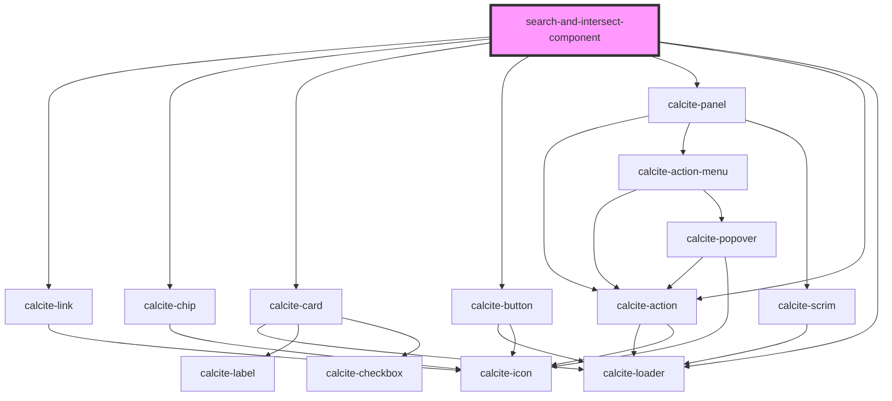

# search-and-intersect-component

<!-- Auto Generated Below -->

## Properties

| Property              | Attribute               | Description                                                                                                                                                         | Type                                                                                       | Default         |
| --------------------- | ----------------------- | ------------------------------------------------------------------------------------------------------------------------------------------------------------------- | ------------------------------------------------------------------------------------------ | --------------- |
| `intersectChipFields` | `intersect-chip-fields` | Any fields to be displayed using a `<calcite-chip>` rather than as plain text as a comma-delimited list. (Optional)                                                 | `string`                                                                                   | `undefined`     |
| `intersectDistance`   | `intersect-distance`    | The buffer distance to use for the spatial query. (Optional)                                                                                                        | `number`                                                                                   | `1000`          |
| `intersectFields`     | `intersect-fields`      | The fields to be fetched by the spatial query as a comma-delimited list. (Required)                                                                                 | `string`                                                                                   | `undefined`     |
| `intersectTitle`      | `intersect-title`       | The title shown above the intersected results list in the UI.                                                                                                       | `string`                                                                                   | `undefined`     |
| `intersectUnit`       | `intersect-unit`        | The distance unit to use for the buffer. (Optional)                                                                                                                 | `"feet" \| "kilometers" \| "meters" \| "miles" \| "nautical-miles" \| "us-nautical-miles"` | `'meters'`      |
| `intersectUrl`        | `intersect-url`         | The URL of the feature service to use when performing a spatial query (intersects) around a selected place. (Required)                                              | `string`                                                                                   | `undefined`     |
| `mapAutoZoom`         | `map-auto-zoom`         | If a results map is used, the initial zoom level for that map. (Optional)                                                                                           | `number`                                                                                   | `7`             |
| `mapLinkLabel`        | `map-link-label`        | If a results map is used, the label to show for any buttons linking results to the map. (Optional)                                                                  | `string`                                                                                   | `'Show on map'` |
| `searchDisplayFields` | `search-display-fields` | The fields to display in the search drop-down list as a comma-delimited string. (Optional) If not supplied `searchFields` will be used.                             | `string`                                                                                   | `undefined`     |
| `searchFields`        | `search-fields`         | The fields to be searched within the feature service to match places as a comma-delimited string. (Optional) If not supplied uses the Esri World Geocoder defaults. | `string`                                                                                   | `undefined`     |
| `searchPlaceholder`   | `search-placeholder`    | Placeholder text for the search input box. (Optional)                                                                                                               | `string`                                                                                   | `undefined`     |
| `searchTitle`         | `search-title`          | The title shown above the search box in the UI.                                                                                                                     | `string`                                                                                   | `undefined`     |
| `searchUrl`           | `search-url`            | The URL of the feature service to use when searching for places. (Optional) If not supplied the search will default to the Esri World Geocoder.                     | `string`                                                                                   | `undefined`     |
| `useMap`              | `use-map`               | Whether to show a map of the results or not. (Optional)                                                                                                             | `boolean`                                                                                  | `false`         |

## Dependencies

### Depends on

- calcite-link
- calcite-chip
- calcite-card
- calcite-button
- calcite-panel
- calcite-action
- calcite-loader

### Graph

----------------------------------------------

*Built with [StencilJS](https://stenciljs.com/)*
